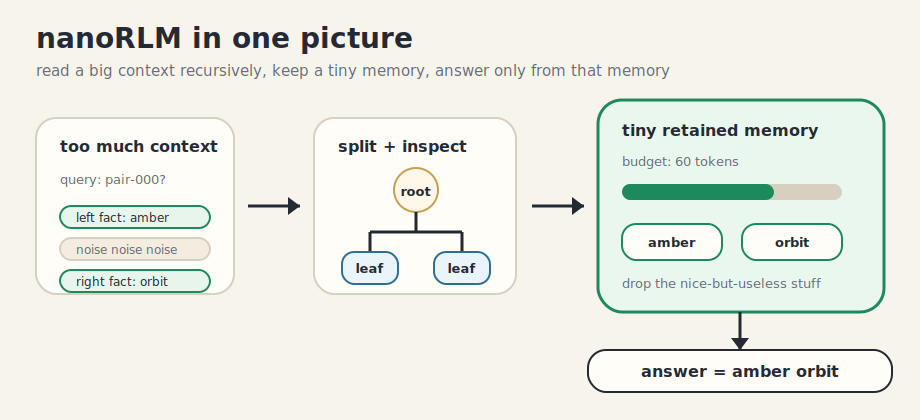

# nanoRLM

`nanoRLM` is a tiny, inference-only playground for Recursive Language Models.

The whole thing is meant to fit in your head: split a big context, read the pieces, keep a small memory, then answer from that memory. Think `nanoGPT`, but for recursive inference instead of training a transformer.

This is not trying to be a framework. The goal is a small repo you can read in one sitting, hack on, and use to sanity-check retention policies without spelunking through a giant stack.

## The Picture



That's basically it. The interesting part is the bottleneck in the middle.

You start with too much context. Recursion turns it into small leaf inspections. Each leaf produces a little `MemoryItem`. The retention policy has to decide what survives the token budget. The final answer only sees that retained memory.

So if the policy drops the important clue, the model loses. If it keeps the right complementary clues, it can win with a tiny memory.

## What's In Here

- `nanorlm.py`: the core recursion loop, trace recorder, OpenAI-compatible transport, and deterministic offline backend
- `policies.py`: `keep_recent`, `summary_only`, `single_critic_topk`, and `pairwise_tournament`
- `bench.py`: synthetic ablations plus a curated `Verifiers-20` loader
- `examples/`: runnable scripts and the `verifiers_20.json` question set
- `tests/`: unit tests for recursion, budget enforcement, and policy behavior
- `AGENTS.example.md`, `CLAUDE.example.md`, `ROADMAP.example.md`: tracked templates for local gitignored assistant and planning files

## Why Bother?

There are already serious RLM implementations inside larger research stacks. This repo is going for a different vibe: small enough to study line by line, but real enough to produce traces, benchmarks, and retention-policy failures you can actually inspect.

The bet is that recursive inference is easiest to understand when the code is almost boring:

- one small OpenAI-compatible code path
- one deterministic, schema-opaque offline backend for tests and smoke demos
- four side-by-side retention policies, including a pairwise-critic tournament — and a clear roadmap to a principled Bradley-Terry + submodular retention framework

## Local Working Files

`AGENTS.md`, `CLAUDE.md`, and `ROADMAP.md` are intentionally gitignored. The repo tracks `*.example.md` versions instead so contributors can keep local agent guidance and planning notes without publishing them.

To start from the shared templates:

```bash
cp AGENTS.example.md AGENTS.md
cp CLAUDE.example.md CLAUDE.md
cp ROADMAP.example.md ROADMAP.md
```

## Quickstart

```bash
uv sync
uv run python -m unittest discover -s tests -v
uv run python bench.py --dataset pairbench --limit 10 --budget 60 --depth 2
uv run python bench.py --dataset needlepairs --limit 10 --budget 60 --depth 2
```

To run the curated repo-QA demo over Prime Intellect's `verifiers` repository:

```bash
git clone --depth 1 https://github.com/PrimeIntellect-ai/verifiers.git /tmp/nanorlm-verifiers
uv run python examples/run_verifiers.py --repo-root /tmp/nanorlm-verifiers
```

To swap in a real OpenAI-compatible model:

```bash
export OPENAI_API_KEY=...
uv run python examples/run_verifiers.py \
  --openai \
  --model gpt-4.1-mini \
  --base-url https://api.openai.com/v1 \
  --repo-root /tmp/nanorlm-verifiers
```

For a local OpenAI-compatible endpoint such as Ollama:

```bash
uv run python examples/run_verifiers.py \
  --openai \
  --model qwen3:14b \
  --base-url http://localhost:11434/v1 \
  --repo-root /tmp/nanorlm-verifiers
```

## Core API

```python
from nanorlm import ContextBlock, RLM, RLMConfig

context = [
    ContextBlock(name="notes/a.md", text="The rendezvous was scheduled at the east pier."),
    ContextBlock(name="notes/b.md", text="The passphrase for the east pier is 'quiet morning'."),
    ContextBlock(name="notes/c.md", text="Unrelated: lunch is at noon in the cafeteria."),
]

config = RLMConfig(
    model="demo/heuristic",
    base_url="http://localhost:11434/v1",
    max_depth=2,
    memory_budget_tokens=60,
    retention_policy="pairwise_tournament",
    seed=0,
)

result = RLM(config).completion("What is the passphrase for the east pier?", context)
print(result.answer)
print(result.trace.tree)
```

The `demo/heuristic` backend is a deterministic, lexical-overlap scorer — useful for understanding the control flow and exercising policies, but not for real reasoning. Point `base_url` at an OpenAI-compatible endpoint (with an API key) and any of the policies will dispatch through `OpenAIChatBackend` instead.

`RLMConfig` exposes the public control surface:

- `model`
- `base_url`
- `api_key`
- `max_depth`
- `max_steps`
- `memory_budget_tokens`
- `retention_policy`
- `sandbox`
- `seed`

`RLM(config).completion(query, context)` returns an `RLMResult` with:

- `answer`
- `trace`
- `usage`
- `cost_estimate`
- `kept_items`

## Retention Policies

- `keep_recent`: blunt recency baseline
- `summary_only`: aggressively compresses memory and drops structured metadata
- `single_critic_topk`: scores each candidate independently with the critic, keeps top-k under budget
- `pairwise_tournament`: runs a lightweight multi-round pairwise tournament via the critic, ranks by wins/score/timestamp, then fills the budget greedily

The memory item schema is intentionally simple:

- `summary`
- `provenance`
- `raw_pointer`
- `tokens`
- `depth`
- `timestamp`

The implementation also keeps optional `answer_candidate`, `confidence`, and lightweight metadata when a backend can extract it.

## Benchmarks

> **Empirical status — honesty pass.** An earlier revision of this repo reported headline accuracy numbers on the synthetic `PairBench` / `NeedlePairs` datasets. Those numbers were produced against a heuristic offline backend that co-evolved with the benchmark schema: the "deterministic" backend had hard-coded regex extraction for `PAIR_ID` / `FACT_KIND` / `FACT_VALUE` markers and a literal pair-reassembly oracle, and one of the retention policies also special-cased the same metadata keys. Those tricks have been removed. The heuristic backend is now schema-opaque: it does pure lexical overlap, ranks by critic score, and composes an answer from retained summaries — no oracle, no structural shortcuts.
>
> Honest numbers on real long-context benchmarks (RULER, BABILong, RepoQA-20) with real models (one API, one local) are the milestone-5 deliverable on the v1.0 roadmap. Until then, the repo should be read as a **mechanism reference**, not a performance claim.

### PairBench, NeedlePairs (in-repo synthetic datasets)

```bash
uv run python bench.py --dataset pairbench --limit 10 --budget 60 --depth 2
uv run python bench.py --dataset needlepairs --limit 10 --budget 60 --depth 2
```

These now serve as **smoke tests and trace demos only** — they exercise the split / recurse / retain / answer loop end-to-end without relying on a model backend. Accuracy against the deterministic heuristic backend is near zero on both, as expected: assembling "left + right" facts across document fragments requires actual language reasoning, not regex.

### Verifiers-20 (curated real-repo codebase QA)

`examples/verifiers_20.json` is a hand-curated set of 20 QA pairs over `PrimeIntellect-ai/verifiers`, each tagged with `must_contain` strings and `provenance` files. This is the only dataset in the repo aimed at real-model evaluation; the heuristic backend is not expected to score well on it.

```bash
git clone --depth 1 https://github.com/PrimeIntellect-ai/verifiers.git /tmp/nanorlm-verifiers
uv run python examples/run_verifiers.py --openai --model gpt-4.1-mini \
  --base-url https://api.openai.com/v1 --repo-root /tmp/nanorlm-verifiers
```

## Example Trace

Live runs emit per-example JSONL traces to `outputs/<dataset>/` and a compact text tree alongside. A static snapshot from an earlier run lives at [`examples/pairbench_trace.txt`](examples/pairbench_trace.txt) — the branching / retain / leaf structure is the same today; the specific `answer_preview` depends on the backend.

## Current Scope

This is `v0.1` after the empirical honesty pass — not the full v1.0 story.

Implemented now:

- minimal recursive inference engine with deterministic, seed-stable traces
- four retention policies (keep_recent, summary_only, single_critic_topk, pairwise_tournament)
- schema-opaque deterministic offline backend for tests and smoke demos
- stdlib-only OpenAI-compatible backend for real runs
- in-repo synthetic datasets (PairBench, NeedlePairs) for structural smoke tests
- curated `Verifiers-20` codebase-QA dataset for real-model runs
- JSONL traces plus a compact tree renderer

Deliberately not implemented yet (on the v1.0 roadmap):

- real-model headline numbers on established long-context benchmarks (RULER, BABILong)
- principled retention math (Bradley-Terry + submodular coverage + info-gain recursion)
- a model-driven RLM engine faithful to the "context-as-REPL" mechanism
- companion paper / blog with Pareto figures
- Docker sandbox execution

## Testing

```bash
uv run python -m unittest discover -s tests -v
```

The test suite covers:

- recursive execution and trace generation
- memory-budget enforcement across all four policies
- seed-stable determinism of engine + policy output
- policy-specific selection behavior on controlled inputs
