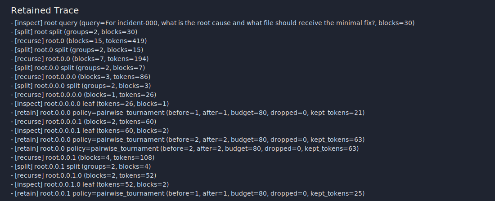

# nanoRLM

`nanoRLM` is a small, inference-only reference implementation for recursive long-context inspection with pluggable retention policies.

The goal is not to be a framework. The goal is to be the repo you can read in one sitting and still get real recursive traces, provider-portable runs, and reproducible report bundles out of it.

## What We Are Building


The whole repo is this loop: start with a root query over too much context, recurse until each shard is small enough to inspect, turn leaf inspections into explicit `MemoryItem`s, keep only what survives the token budget, then answer from retained evidence instead of the full context.

If the retention policy drops a needed fact, the final answer loses it too. That is the central research surface in `nanoRLM`.

## Thesis

Modern long-context systems still fail in a very specific way: they look at everything, but they do not reliably keep the right intermediate evidence under pressure.

`nanoRLM` focuses on that exact gap:

- a tiny recursive inference loop with one small provider seam
- a deterministic offline backend for tests and smoke demos
- two tiny network backends: OpenAI-compatible and Anthropic Messages
- a minimal memory interface with swappable retention policies
- a tournament-style `pairwise_tournament` policy that tries to preserve complementary evidence instead of just top-scoring snippets

## Quickstart With `uv`

This repo is meant to stay easy to run from a fresh machine with `uv`.

If you are learning the repo day to day, use this flow first:

```bash
uv sync
uv run python --version
uv run python -m unittest discover -s tests -v
uv run python bench.py --dataset verifiers_smoke --limit 2 --budget 80 --depth 2 --repo-root tests/fixtures/verifiers-mini
uv run python examples/run_dossiers.py --limit 4 --budget 80 --depth 4
```

The repo pins Python in [`.python-version`](.python-version), keeps project metadata in [`pyproject.toml`](pyproject.toml), and resolves the environment through [`uv.lock`](uv.lock).

For the repo-specific mental model, exact smoke commands, and a short cheat sheet, see [UV.md](UV.md).

## Tiny Example

```python
from nanorlm import ContextBlock, RLM, RLMConfig

context = [
    ContextBlock(name="incident-a.txt", text="The API gateway rollout is blocked by a stale endpoint registry cache."),
    ContextBlock(name="incident-b.txt", text="Reloading the registry and invalidating the cache unblocks the rollout."),
    ContextBlock(name="incident-c.txt", text="The infra team owns the fix and plans the patch after the next deploy window."),
]

config = RLMConfig(
    model="demo/heuristic",
    provider="heuristic",
    max_depth=4,
    memory_budget_tokens=60,
    retention_policy="pairwise_tournament",
    seed=0,
)

result = RLM(config).completion(
    "What is blocking the rollout, and what change fixes it?",
    context,
)

print(result.answer)
print(result.trace.tree)
```

`provider` selects `heuristic`, `openai_compatible`, `anthropic`, or `auto`. `base_url` is optional and defaults to the right endpoint for the chosen network provider.

`RLM(config).completion(query, context)` returns an `RLMResult` with:

- `answer`
- `trace`
- `usage`
- `cost_estimate`
- `kept_items`
- `retention_stats`
- `drop_reasons`
- `per_step_budget`

Benchmark rows add scoring fields such as `answer_accuracy`, `provenance_score`, and `provenance_hits`. Those are harness-level checks against expected answers and expected provenance, not engine output.

## Evidence Status

The repo already emits a stable report bundle:

- `summary.json`
- `per_case.jsonl`
- `curves.json`
- `experiment_report.md`
- `trace_examples/`

That makes the current artifact useful for:

- provider-portable recursive runs over the same engine
- readable recursive traces and retained-memory inspection
- compact post-run analysis of policy deltas, task-level misses, and failure clusters
- `Verifiers-30` codebase-QA runs with real model backends
- dossier and planning showcases that demonstrate how retention changes what evidence survives

What it does **not** claim yet:

- real-model headline results on established long-context benchmarks such as `RULER` or `BABILong`
- a paper-faithful model-directed RLM runtime
- public benchmark evidence that `pairwise_tournament` is generally superior beyond the repo's internal smoke and regression fixtures

`examples/benchmark_snapshot.md` is intentionally a deterministic smoke snapshot, not a public benchmark leaderboard.



## Showcases

### 1. Codebase QA

`examples/verifiers_30.json` is a curated `Verifiers-30` benchmark over `PrimeIntellect-ai/verifiers`, organized across:

- `defaults-flags`
- `config-resolution`
- `implementation-location`

Run it with:

```bash
git clone --depth 1 https://github.com/PrimeIntellect-ai/verifiers.git /tmp/nanorlm-verifiers
uv run python examples/run_verifiers.py --repo-root /tmp/nanorlm-verifiers
```

The deterministic backend is only a smoke path here. The flagship use is to point the same engine at a real OpenAI-compatible model:

```bash
export OPENAI_API_KEY=...
uv run python examples/run_verifiers.py \
  --provider openai-compatible \
  --model gpt-4.1-mini \
  --base-url https://api.openai.com/v1 \
  --max-estimated-cost 5 \
  --repo-root /tmp/nanorlm-verifiers
```

For a local OpenAI-compatible endpoint such as Ollama:

```bash
uv run python examples/run_verifiers.py \
  --provider openai-compatible \
  --model qwen3:14b \
  --base-url http://localhost:11434/v1 \
  --repo-root /tmp/nanorlm-verifiers
```

The Anthropic Messages backend is implemented, but the benchmark harness currently rejects Anthropic and unknown remote models because report bundles include cost estimates and there is no checked-in pricing table for those models.

Portability limits:

- `any local LLM` here means any local model served behind an OpenAI-compatible `chat/completions` endpoint such as Ollama, `vLLM`, `llama.cpp` server, `LM Studio`, or `LocalAI`
- native Claude works through the Anthropic Messages API at the backend-contract level, but it is not a priced benchmark-report path yet
- bespoke local runtime APIs are intentionally out of scope

### 2. Long-Horizon Dossiers

`examples/run_dossiers.py` is the main retention showcase: noisy incident, migration, and release-blocker dossiers where the answer depends on keeping complementary clues across recursive branches.

```bash
uv run python examples/run_dossiers.py --limit 12 --budget 80 --depth 4
```

Treat dossier results as an internal synthetic regression surface, not as headline evidence of general long-context performance.

### 3. Grounded Planning

`examples/run_planning.py` turns retained evidence into a read-only patch plan with ordered steps, citations, and explicit unknowns.

```bash
uv run python examples/run_planning.py \
  --repo-root /tmp/nanorlm-verifiers \
  --limit 10 \
  --budget 140 \
  --depth 2
```

The planning suite writes markdown plans plus `summary.json` / `per_case.jsonl` under `showcases/outputs/planning/`.

### 4. PairBench And NeedlePairs

For the smallest synthetic sanity checks:

```bash
uv run python bench.py --dataset pairbench --limit 10 --budget 60 --depth 2
uv run python examples/run_needlepairs.py --limit 10 --budget 60 --depth 3
```

These are useful for quick smoke tests, trace demos, and test-friendly regressions. They are not the public empirical story for the repo.

### 5. External Benchmark JSONL

`external_jsonl` is an adapter for externally generated long-context benchmark exports, including RULER-style JSONL rows. It lets the same nanoRLM harness run over established benchmark data without vendoring benchmark datasets into this repo.

```bash
uv run python bench.py \
  --dataset external_jsonl \
  --dataset-path /tmp/ruler-or-other-long-context-export.jsonl \
  --limit 4 \
  --budget 80 \
  --depth 2
```

This is adapter support, not a published benchmark result. Any README metrics from external data should include the exact generation source, command, model, and output bundle.

For RULER-generated JSON or JSONL files, first normalize the export into the adapter shape:

```bash
uv run python scripts/prepare_ruler_external_jsonl.py \
  --input /tmp/ruler-generated.jsonl \
  --output /tmp/nanorlm-ruler-small.jsonl \
  --limit 12
```

For a bounded OpenAI-compatible real-model run, use a cache directory plus a cost cap:

```bash
uv run python bench.py \
  --dataset external_jsonl \
  --dataset-path /tmp/nanorlm-ruler-small.jsonl \
  --limit 12 \
  --policies direct_full_context,keep_recent,pairwise_tournament \
  --budget 120 \
  --depth 3 \
  --provider openai-compatible \
  --model gpt-5.4-mini \
  --base-url https://api.openai.com/v1 \
  --cache-dir outputs/cache/openai-gpt-5.4-mini \
  --max-estimated-cost 20 \
  --output-dir outputs/real-runs/openai-ruler-small
```

`direct_full_context` is a true direct-answer baseline: the answer step receives every raw context block and does not apply the retention budget. Recursive policies inspect shards into retained memory and then answer only from what survives the budget.

`--max-estimated-cost` is global for the whole policy sweep, not per policy. The harness checks the completed-case cumulative estimate before starting each case, so a single final case can move the total slightly past the cap before the next case or policy stops. Remote cost reporting is intentionally limited to the built-in priced OpenAI-compatible model table; unknown OpenAI-compatible models and Anthropic benchmark runs are rejected instead of reported as zero-cost.

Network-provider report bundles avoid hidden second-pass API calls: their `curves.json` is derived from the already completed summaries rather than re-running the sweep.

Small OpenAI-backed snapshots are tracked as mechanics and reproducibility artifacts, not headline benchmark claims:

- [`examples/real_runs/openai_ruler_small/benchmark_snapshot.md`](examples/real_runs/openai_ruler_small/benchmark_snapshot.md)
- [`examples/real_runs/openai_external_mini/benchmark_snapshot.md`](examples/real_runs/openai_external_mini/benchmark_snapshot.md)

## Generate Assets

Run a benchmark, then turn its saved report bundle into launch-ready figures:

```bash
uv run python showcases/generate_assets.py --report-dir outputs/dossierbench
```

This writes:

- `benchmark_snapshot.md`
- `architecture.svg`
- `policy_curve.svg`
- `trace_card.svg`

The showcase workflow is documented in [showcases/README.md](showcases/README.md).

## Repo Layout

- `nanorlm.py`: recursion loop, trace recorder, OpenAI-compatible backend, Anthropic backend, deterministic backend
- `policies.py`: `keep_recent`, `summary_only`, `single_critic_topk`, `pairwise_tournament`
- `bench.py`: datasets, evaluation harness, curve generation, report bundle writer
- `examples/`: minimal runnable demos
- `showcases/`: launch-facing demos, planning suite, asset generation
- `tests/`: recursion, policy, report-bundle, smoke-fixture, and planning tests

## Testing

Use [UV.md](UV.md#canonical-verification) as the canonical local verification path.

```bash
uv lock --check
uv sync --frozen
uv run python -m unittest discover -s tests -v
uv run --with pytest pytest
uv run python -m py_compile nanorlm.py policies.py bench.py scripts/prepare_ruler_external_jsonl.py examples/run_verifiers.py examples/run_needlepairs.py examples/run_dossiers.py examples/run_planning.py showcases/planning.py showcases/generate_assets.py
uv run python bench.py --dataset pairbench --limit 4 --budget 60 --depth 2
uv run python bench.py --dataset verifiers_smoke --limit 2 --budget 80 --depth 2 --repo-root tests/fixtures/verifiers-mini
uv run python bench.py --dataset external_jsonl --dataset-path tests/fixtures/external-benchmark-mini.jsonl --limit 2 --budget 80 --depth 2
```

GitHub Actions keeps PR checks fast:

- `CI` runs `uv lock --check`, frozen sync, unit tests, and the compile check on Python 3.11 and 3.12.
- `smoke` uses the same `uv` setup on Python 3.11, then runs the same core checks plus the deterministic PairBench and Verifiers smoke fixtures.

CI intentionally does not run real-model jobs, networked benchmark jobs, or full benchmark sweeps.

## Current Scope

Implemented now:

- small recursive inference engine with stable public API
- four retention policies
- provider portability across heuristic, OpenAI-compatible, and Anthropic backends
- richer `RLMResult` metadata for retention analysis
- synthetic `PairBench`, `NeedlePairs`, and dossier fixtures for smoke and regression use
- curated `Verifiers-30` repo-QA benchmark
- external JSONL adapter for established benchmark exports
- grounded planning showcase
- JSONL/tree traces and asset generation from saved reports

Still intentionally out of scope for this phase:

- training infrastructure
- framework-style agent abstractions
- Docker sandbox execution
- fully autonomous coding loops
